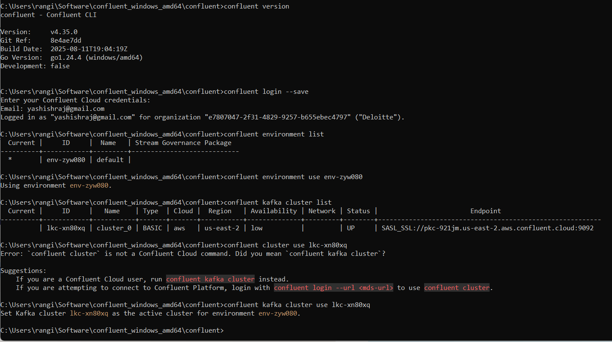

Set up Confluent Cloud.
Create a Kafka topic, produce messages, and read them using the Cloud Console and CLI.
Produce additional messages via CLI and view real-time streams in both the CLI and Cloud Console.

Create a Kafka cluster and choose your preferred cloud provider, region, and availability zone.


After installing the CLI, follwo these steps to configure and set up the CLI to use

1. Log in to Confluent Cloud:

confluent login --save

It will take you to a browser to Allow access. The --save flag stores credentials locally to reduce repeated logins



Run command "confluent environment list" and you’ll likely see only one environment. Note the ID.

2. Set environment:

```sh
confluent environment use {ID}
```

3. List Kafka Clusters

```sh
confluent kafka cluster list
```

4. Set the Kafka cluster to use

```sh
confluent kafka cluster use {ID}
```

5. Create and apply an API key for the CLI to communicate with the Kafka cluster:

```sh
confluent api-key create --resource {ID}
```

6. Save the key and secret somewhere safe. Then run:

```sh
confluent api-key use {API Key} --resource {ID}
```

Your CLI is now fully set up.