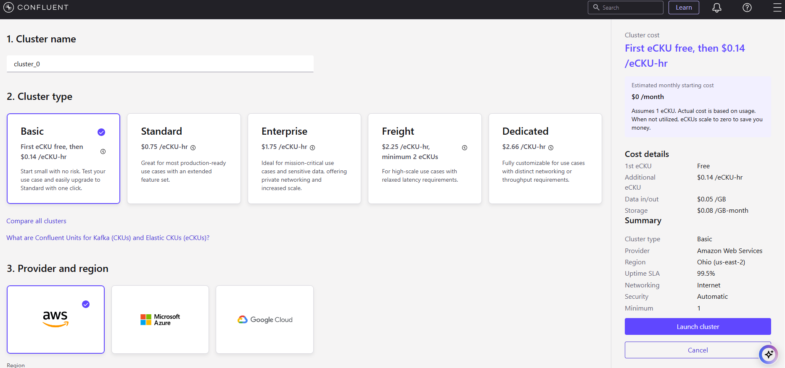
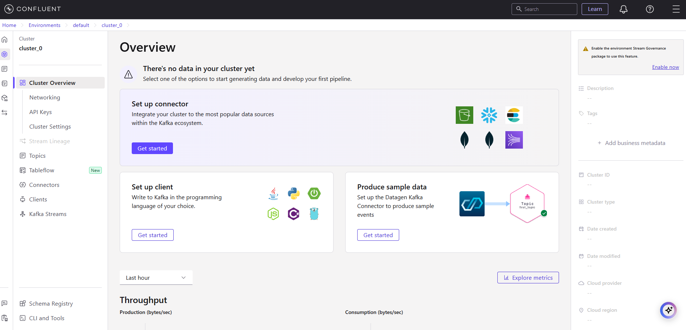

Set up Confluent Cloud.
Create a Kafka topic, produce messages, and read them using the Cloud Console and CLI.
Produce additional messages via CLI and view real-time streams in both the CLI and Cloud Console.

Create a Kafka cluster and choose your preferred cloud provider, region, and availability zone.

