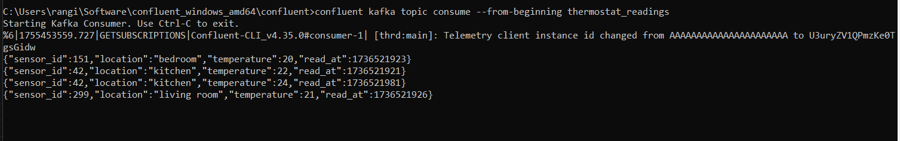

# Produce and Consume using the Confluent CLI

## 1. List available topics:

```sh
confluent kafka topic list
```


## 2. Consume messages from the beginning:

```sh
confluent kafka topic consume --from-beginning thermostat_readings
```
The --from-beginning flag tells the consumer to start from the earliest known offset on the topic, i.e., the earliest message. Leave this terminal window open to observe new messages.



## 3. In a new terminal window, produce more messages

```sh
confluent kafka topic produce thermostat_readings --parse-key
```
The --parse-key flag automatically reads both the key and the value separated by the ":" symbol.


## 4. When prompted, enter:

```sh
299:{"sensor_id":299,"location":"living room","temperature":21,"read_at":1736522046}
151:{"sensor_id":151,"location":"bedroom","temperature":21,"read_at":1736522043}
42:{"sensor_id":42,"location":"kitchen","temperature":26,"read_at":1736522101}
```


## 5. Watch these new messages appear in your consumer terminal window.

## 6. Go the Confluent Cloud UI, navigate to the thermostat_readings topic, and open the "Messages" tab to confirm that the new messages are visible in the UI.

Congratulations!🎉 you’ve successfully produced and consumed messages via the CLI

